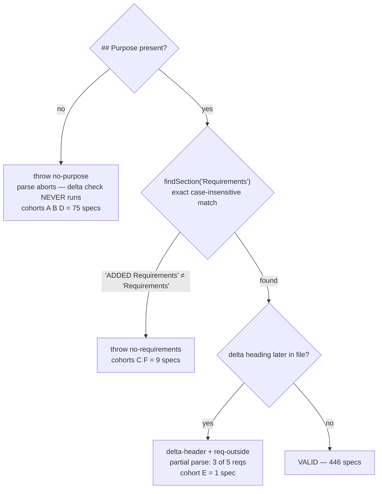

# Repair the 85 structurally invalid main specs and gate spec integrity in CI

## Why

`openspec validate --specs` has never run in this repo. There is a CI gate on the
openspec **version** (`ci.yml:32`) but none on spec **content**. In that blind
spot, **85 of 531 main specs** drifted into states the parser cannot read, hiding
**413 live requirement blocks** from `validate`, `list`, `show`, and `archive`
(plus 9 already-retired ones in a spec that should not exist at all).

Resolution: **82 specs are repaired, 3 are deleted.**

This was found while repairing `oauth-authentication` for its archive. That spec
was one instance of a repo-wide class.

### The parse contract

`MarkdownParser.parseSpec` (`dist/core/parsers/markdown-parser.js`) requires two
h2 sections and **throws** without them:

```js
if (!purpose)             throw new Error('Spec must have a Purpose section');
if (!requirementsSection) throw new Error('Spec must have a Requirements section');
```

`findSection` matches the title **exactly** (case-insensitively). `## ADDED
Requirements` is therefore not `## Requirements` — it is an unrelated section, and
every `### Requirement:` beneath it is invisible.

### The failure is loud, but the diagnosis is masked

Contrary to first appearances these specs are **not** silently broken —
`validate` reports each one. What is masked is the *second* defect: the
`no-purpose` throw short-circuits parsing **before** the delta-header check runs.
So the 63 specs in cohort A report only "missing Purpose". Repair Purpose and a
fresh error class surfaces. **Any repair is inherently two-phase**; a script that
validates once and reports green after phase one is lying.



### Six cohorts, one root cause

The corruption is an **archive-path artifact**: a change's delta spec
(`openspec/changes/<name>/specs/<cap>/spec.md`, which legitimately uses `## ADDED
Requirements`) was copied to `openspec/specs/<cap>/spec.md` verbatim, without the
delta→main transformation. Corroborating evidence: **82 of the 85 also lack the
`# <name> Specification` h1** that the archive's spec-creation path emits, and
**111 already-valid specs** carry the archive's literal placeholder
`TBD - created by archiving change <name>. Update Purpose after archive.`

| # | `## Purpose` | plain `## Requirements` | delta hdr | `validate` reports | specs | hidden reqs |
|---|---|---|---|---|---|---|
| **A** | ✗ | ✗ | ✓ | `no-purpose` *(masks delta)* | 62 | 324 |
| **B** | ✗ | ✗ | ✗ | `no-purpose` | 7 | 27 |
| **C** | ✓ | ✗ | ✓ | `no-requirements` | 7 | 37 |
| **D** | ✗ | ✓ | ✗ | `no-purpose` | 5 | 20 |
| **E** | ✓ | ✓ | ✓ | `delta-header` + `req-outside` | 1 | 5 |
| **F** (delete) | ✓ | ✗ | ✗ | `no-requirements` | 2 | 0 |
| **G** (delete) | ✗ | ✗ | `REMOVED` | `no-purpose` | 1 | 0 *(9 retired)* |
| | | | | | **85** | **413 live** |

Cohorts **B** and **D** (12 specs) carry **no delta heading at all** — a
delta-only fix leaves them broken. Cohort **F** is two superseded stubs with zero
requirements.

### Two traps that will break a naive repair

1. **Multi-delta specs must have the heading DELETED, not renamed.** Four specs
   carry two delta headings. `findSection` returns the **first** match, so
   renaming both yields a second, ignored `## Requirements` whose requirements
   stay invisible — a repair that reports success and changes nothing:

   | Spec | Headings |
   |---|---|
   | `app-decomposition` | `ADDED Requirements` ×2 |
   | `browser-gateway-decomposition` | `ADDED Requirements` ×2 |
   | `command-executor` | `ADDED Requirements`, `ADDED Requirements — Tool Modules` |
   | `auto-shutdown` | `MODIFIED Requirements`, `ADDED Requirements` |

   The first becomes `## Requirements`; every subsequent one is deleted so its
   requirements re-parent to the single surviving section.

2. **`## REMOVED Requirements` is not a rename candidate — it is a delete signal.**
   `event-persistence` (cohort G) uses it. Promoting those 9 requirements to
   `## Requirements` would **resurrect retired requirements as current spec**.

   Investigated and settled: the file has **9 `### Requirement:` headers and 9
   `**Reason**:` blocks** — every requirement is retired, none is current. The
   capability (SQLite event store) was wholly replaced, and all named successors
   exist as live specs: `in-memory-event-buffer`, `json-file-persistence`,
   `on-demand-session-replay`, `session-history-sync`. The only remaining SQLite
   in source is `packages/kb/` — an unrelated knowledge-base store.

   **`event-persistence` is therefore deleted, not repaired.** The repair script
   must still *refuse* `REMOVED` blocks generically, because the next such spec
   may be a partial removal where deletion would be wrong.

## What Changes

- **Add `scripts/repair-main-specs.mjs`** — idempotent structural repair, kept in
  `scripts/` for future drift (the archive bug may not be fixed upstream):
  - Promote the **first** delta heading to `## Requirements`; **delete** every
    subsequent one (trap 1).
  - Insert `## Purpose` with a `TODO(repair):`-marked placeholder when absent.
  - Insert the `# <name> Specification` h1 when absent.
  - **Refuse** to touch `## REMOVED Requirements` — exit non-zero naming the spec
    for manual handling (trap 2).
  - Re-run `validate` after the write and report **phase-two** errors, so masked
    defects surface in the same run.
- **Author a real `## Purpose` for all 74 specs missing one** (cohorts A, B, D),
  derived from each spec's own requirement text. The script's placeholder is
  scaffolding, not the deliverable — **no `TODO(repair):` marker may survive**.
  This is the bulk of the work and is per-spec judgement, not scripted.
- **Hand-repair `interactive-renderers`** (cohort E) — delete the mid-file
  `## ADDED Requirements` at line 75; its 2 orphaned requirements re-parent into
  the existing section, taking the spec from 3 visible requirements to 5.
- **Delete three spec directories** — all retired capabilities holding zero
  current requirements, each with a live successor verified to carry the
  behaviour:

  | Spec | Cohort | Successor |
  |---|---|---|
  | `openspec-polling` | F | `server-openspec-polling` |
  | `session-history-sync` | F | *(self-declared `**DEPRECATED**`)* |
  | `event-persistence` | G | `in-memory-event-buffer`, `json-file-persistence`, `on-demand-session-replay` |
- **Add a CI gate** to `.github/workflows/ci.yml`:
  `openspec validate --specs --no-interactive`. This is the change's durable
  half — it converts spec integrity from an invisible property into a blocking
  one, repo-wide, for every future archive.
- **Add `npm run spec:validate`** so the gate is reproducible locally without
  guessing CI's invocation.

## Capabilities

### New Capabilities

- `openspec-spec-integrity` — the structural contract every main spec must
  satisfy (`## Purpose` + `## Requirements`, no delta headers), the CI gate that
  enforces it, and the repair tool's guarantees (idempotence, REMOVED refusal,
  two-phase validation).

### Modified Capabilities

- `ci-cd-pipeline` — gains a spec-integrity job.

## Non-Goals

- **Fixing the upstream archive bug.** The delta→main copy defect lives in
  `@fission-ai/openspec`. This change repairs the damage and gates recurrence;
  an upstream fix or a pre-archive hook is separate work.
- **Rewriting the 111 valid specs that carry the `TBD - created by archiving
  change` placeholder.** They parse and validate. Authoring real Purposes for
  them is a documentation debt, tracked separately — this change only guarantees
  no *newly written* placeholder survives.
- **Resolving the `[INFO] Requirement text is very long (>500 characters)`
  advisories.** Non-blocking, widespread, orthogonal.
- **Changing requirement or scenario content.** Except the two trap specs, this
  is heading surgery plus Purpose authoring. No requirement text is edited.
- **`--strict` mode.** The gate runs default validation; strict adds advisory
  classes the repo has not triaged.

## Impact

- `openspec/specs/**/spec.md` — 82 repaired, 3 deleted.
- `scripts/repair-main-specs.mjs` — new.
- `.github/workflows/ci.yml`, `package.json` — new gate + script.
- **Every future archive** — a corrupt spec now fails CI instead of rotting. That
  is the point, and the risk: a spec that archives into an invalid state will
  block `develop`, so `openspec-archive-change` / `ship-change` should validate
  before pushing rather than discovering it in CI.
- **`kb`/docs surfaces that read specs** — 413 requirements become visible for the
  first time. Any consumer that counted requirements will see its numbers jump;
  this is a correction, not a regression.

## Open Questions

- **Does authoring 74 Purposes belong in one change?** It is ~74 independent
  judgement calls with no shared risk. Splitting structural repair + gate (fast,
  mechanical, high value) from Purpose authoring (slow, reviewable) would let the
  gate land in days rather than weeks — but the gate cannot go green until the
  Purposes exist, so a split needs the gate gated on the authoring change.
- ~~Should `event-persistence`'s 9 REMOVED requirements be restored?~~
  **Resolved:** no. All 9 are retired with documented successors that exist as
  live specs; the spec is deleted.
- **Is deleting the three retired specs right, or should they remain as
  deprecation tombstones?** Deleting loses the "moved to X" pointers, which are
  genuinely useful to a reader who greps for `event-persistence`. A
  one-requirement tombstone would keep the pointer and satisfy the parser.
- **Is `--no-interactive` sufficient in CI, or is `--concurrency` tuning needed?**
  531 specs at default concurrency 6; the sweep above took minutes locally, which
  may be material for PR latency.

## Discipline Skills

- `doubt-driven-review` — 85 spec files rewritten at once is effectively
  irreversible in review (nobody reads an 85-file diff carefully); and the
  REMOVED-requirements decision changes what the project claims to do. Stress
  both before they stand.
- `review-code` — the repair script's idempotence and its REMOVED refusal are the
  two properties whose failure is silent and destructive.
- `scenario-design` — the traps above (multi-delta, REMOVED, masked phase-two
  errors) are exactly the cases a naive test suite misses; derive scenarios
  before writing the script.
