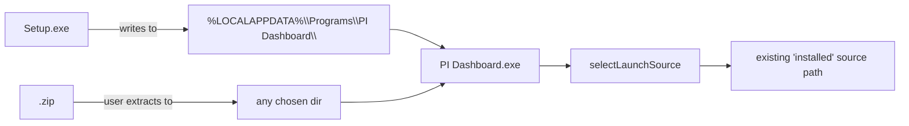

## Context

NSIS was removed in v0.5.0 by `simplify-electron-bootstrap-derived-state`. This proposal restores it and simultaneously drops `portable.exe`. The decision space — *which Windows installer, why now, why not the alternatives* — was explored in the conversation that produced this change. Decisions captured here.

## Decision D1 — NSIS toolchain: electron-builder + custom include script

**Choice:** `electron-builder --win nsis` invoked as a sidecar step in the CI Windows build, **extended via the `nsis.include` config option** with a custom `packages/electron/build/installer.nsh` that adds MUI2 branding, the multi-user install-mode page, and JUDO-style registry writes. electron-builder generates the NSIS script and `!include`s our file before compilation — we extend, we do not replace.

**Rejected alternatives:**

- **`@felixrieseberg/electron-forge-maker-nsis`** — what was used before v0.5.0 removal. Last npm publish 2021, no recent maintenance, single maintainer outside the Forge team. Removed by `simplify-electron-bootstrap-derived-state`. Reintroducing it ties us to an unmaintained surface, and the maker has no documented extension point for a custom `.nsh` include — we would lose the branding/install-mode customisation path.
- **`@electron-forge/maker-squirrel`** — officially maintained by the Forge team. Produces a Squirrel.Windows installer, not NSIS. Different UX (silent install, auto-update built in). Users asking for a "real Windows installer with a wizard and an Add/Remove Programs entry" do not get a wizard from Squirrel — they get a silent install that pops a toast. Wrong target.
- **Fully hand-rolled .nsi script (the JUDO designer pattern)** — the JUDO designer ships a complete `install.nsi` written from scratch, invoked directly with `makensis`. Maximum control. But: we would lose electron-builder's electron-version pinning, asar-packaging integration, `extraResources` handling, and the `electron-updater` differ format that lets future auto-update work. Maintenance burden multiplies — every electron major-version upgrade risks breaking our hand-rolled script. We use the JUDO `install.nsi` as **reference and inspiration for branding + multi-user wizard patterns**, not as a script to ship verbatim.
- **electron-builder's `nsis.script` option (full script replacement)** — same downside as fully hand-rolled. The `nsis.include` option is the right granularity.

**Why electron-builder + include script wins:**

- Already a devDependency in `packages/electron/package.json`. Zero new dependency surface.
- The `nsis.include` extension point is documented and stable. electron-builder's generated script handles asar unpacking, electron-version stamping, `extraResources`, and updater hooks; our `.nsh` adds branding + multi-user without re-implementing any of that.
- Forge + electron-builder coexistence is already precedent in this repo. We use Forge for DMG/AppImage/DEB/ZIP and shell out to electron-builder for Windows-specific targets. The pattern extends to NSIS cleanly.
- The JUDO designer's `install.nsi` provides a battle-tested branding / multi-user / selective-uninstall reference that we port to MUI2 idiom inside our include script.

**Trade accepted:** custom `.nsh` is a real surface we own. Mitigation: keep it small (target ~150 LOC); cover with the QA install smoke tests (§5) so any regression in branding or install-mode UX is caught before release.

## Decision D2 — Install mode is a user choice (multi-user mode)

**Choice:** Enable electron-builder's multi-user NSIS mode by **omitting** `perMachine` from the config (omission, not literal `true` or `false`). This causes the generated NSIS script to include the multi-user macro from electron-builder's template, which presents a wizard page asking the user to pick "Install for just me" (per-user, no UAC) or "Install for everyone" (per-machine, UAC-elevated). Default selection: "just me".

**Per-user mode (default):**
- Install dir defaults to `%LOCALAPPDATA%\Programs\PI Dashboard\`.
- Add/Remove Programs entry registered under `HKCU\Software\Microsoft\Windows\CurrentVersion\Uninstall\PI Dashboard`.
- No UAC prompt.
- Start Menu shortcut under the user's profile Start Menu.

**Per-machine mode (opt-in):**
- Install dir defaults to `%PROGRAMFILES%\PI Dashboard\` (architecture-appropriate: `%PROGRAMFILES%` resolves to `Program Files` for x64 install on x64 Windows, `Program Files (x86)` is not used because we ship native x64 / arm64 binaries).
- Add/Remove Programs entry registered under `HKLM\Software\Microsoft\Windows\CurrentVersion\Uninstall\PI Dashboard` (matches the JUDO designer reference's HKLM-only model).
- UAC prompt at the install-mode → install-progress transition.
- Start Menu shortcut under the machine-wide Start Menu (visible to all users).

**Why both modes:**
- The per-user default covers the "I just want to try it on my laptop" path with zero friction.
- Per-machine is the right choice in corporate environments where IT installs the app once for all users on a shared workstation, and in lab / kiosk setups. Forcing those users to fall back to `.zip` defeats the point of shipping a proper installer.
- Multi-user mode is electron-builder's documented pattern for this exact requirement; it carries the install-mode choice into NSIS macros (`$MultiUser.InstallMode`) that propagate to install-dir defaults, registry hive, and shortcut paths automatically.

**Trade accepted: bootstrap must work in both contexts.**
- The bootstrap state machine resolves install location via `app.getPath('exe')` (already true). The `~/.pi/` + `~/.pi-dashboard/` user-data dirs always live in the launching user's profile regardless of install mode — even for per-machine installs, every user who launches the app gets their own user-data tree. This is correct behaviour, not a bug. Documented in design D4.
- Per-machine install with multiple users launching: each user's first launch sees an empty `~/.pi-dashboard/` and runs through `installable.json` reconciliation against the per-user managed dir. The dashboard server installs into the launching user's `~/.pi-dashboard/`, not the shared install dir. This is consistent with how VS Code handles its per-user extensions.

**Rejected: per-user only (the earlier draft).** Locked out the corporate / shared-workstation use case for no real benefit — the bootstrap machine already handles per-user state cleanly whether the app shell is per-user or per-machine.

## Decision D3 — `oneClick: false` AND `allowToChangeInstallationDirectory: true`

**Choice:** Show the standard NSIS Welcome → Choose Install Location → Install → Finish wizard. The install-location page is **editable** — user MAY override the default `%LOCALAPPDATA%\Programs\PI Dashboard\` to any writable directory.

**Why:**

- The reason a user picks Setup.exe over `.zip` is "I want an installer that feels like a Windows app installer." A silent oneClick install (the Squirrel pattern) doesn't deliver that affordance — it would feel like the app is being snuck onto the machine.
- Letting the user choose the install directory matches the expectation set by virtually every other desktop installer on Windows. Users on drives where `%LOCALAPPDATA%` (typically on `C:`) is space-constrained — common in corporate environments and on SSDs with small system partitions — need to install to a different drive. Locking the install dir would force those users to fall back to `.zip`, which defeats the point of shipping Setup.exe.
- Keeps the wizard short (4 clicks: Welcome → Browse-or-accept → Install → Finish) — not a full custom-install wizard with feature trees and component checkboxes.

**Trade accepted: install-path-as-variable.** The bootstrap and `selectLaunchSource()` must read the actual install location dynamically (via `app.getPath('exe')` / `process.resourcesPath`), not assume the default path. Electron's API does the right thing here — we just need to verify no hardcoded `%LOCALAPPDATA%\Programs\PI Dashboard\` strings have crept into the codebase. A verification task in tasks §2.6 grep-audits for this; if any are found, they get fixed before NSIS ships. QA tests §5 cover a non-default install dir to catch regressions.

**Trade accepted: conditional UAC.** If the user picks a system-protected directory (e.g. under `C:\Program Files\`), electron-builder's NSIS auto-elevates to perform the install. UX becomes inconsistent (default path → no UAC; protected path → UAC mid-wizard). This is standard Windows installer behaviour; document it in `docs/installation-windows.md` and `docs/faq.md` so users aren't surprised.

**Rejected alternative:** lock the install dir (`allowToChangeInstallationDirectory: false`). Earlier draft took this path on the rationale that a fixed path narrows the support surface. Reversed because (a) `app.getPath('exe')` makes the support surface narrow regardless of where the user installed — the install path is read, not assumed, and (b) the space-constrained-system-drive use case is real and common.

## Decision D4 — Uninstaller preserves user data

**Choice:** Uninstaller removes only the install dir (`%LOCALAPPDATA%\Programs\PI Dashboard\`). It does **not** delete `~/.pi/` (agent runtime, sessions, settings) or `~/.pi-dashboard/` (managed dependencies, version markers).

**Why:**

- Users uninstalling to "fix something broken" lose every session if we wipe `~/.pi/`. Sessions take real effort to recreate and represent user work.
- The two dirs are shared with the standalone `pi-dashboard` npm install and with pi-agent itself. Wiping them via uninstaller corrupts unrelated installs.
- Matches the macOS DMG / Linux .deb behaviour today: uninstalling the app shell does not wipe `~/.pi/`.
- Final uninstaller page shows a notice: "Your sessions and settings in `%USERPROFILE%\.pi\` and `%USERPROFILE%\.pi-dashboard\` have been preserved. Delete these folders manually if you want a clean removal."

**Rejected:** offering an "also delete user data" checkbox on the uninstaller. Adds a footgun without clear benefit — users who want that can delete the folders themselves with one File Explorer action.

## Decision D5 — Drop portable.exe entirely, do not try to fix it

**Choice:** Remove portable from the pipeline. Do not pursue the "Fix path" of `fix-windows-portable-exe`.

**Why:**

- **Three structural problems stacked.** SFX path drift across launches (root cause is hypothesised in `fix-windows-portable-exe` proposal but not yet confirmed); SmartScreen blocking unsigned SFX before extraction (out-of-scope for portable, in-scope for `windows-authenticode-signing`); ephemeral `%LOCALAPPDATA%\Temp\<random>\` working dir at odds with the per-user managed-dir bootstrap model.
- **Use case fully covered.** Users who want "single-file no-installer experience" can use the `.zip` (extract, double-click `pi-dashboard.exe`). It is one extra step vs. portable but the `.zip` actually works.
- **Maintenance cost vs. distinct value.** Keeping portable would mean: (a) fixing the launch bug, (b) signing it to clear SmartScreen, (c) maintaining a separate test path in `qa/remote/`. None of (a)/(b)/(c) buy a capability we don't already have via Setup.exe + `.zip`.

**Coordination with `fix-windows-portable-exe`:** that proposal's tasks.md §4 ("Drop path") is the path this change takes. Once both proposals merge, `fix-windows-portable-exe` should be closed with a note pointing to this change. If `fix-windows-portable-exe` lands first with §3 (Fix path), this proposal removes the result anyway.

## Decision D6 — Setup.exe naming includes version, not "latest"

**Choice:** `PI-Dashboard-Setup-<version>-<arch>.exe`, e.g. `PI-Dashboard-Setup-0.5.5-x64.exe`.

**Why:**

- The `site/src/lib/github-release.ts` classifier (line 80-83) routes `.exe` containing "setup" (case-insensitive) to priority 0 / "Installer (.exe)". Lower-cased filename matches.
- Version in filename matches `.deb` and `.dmg` conventions already in use.
- arm64 vs x64 disambiguation in the filename matches the existing portable naming (`PI-Dashboard-x64-portable.exe`, `PI-Dashboard-arm64-portable.exe`) — users currently scanning the release page expect arch in the filename.

## Decision D9 — Pi branding assets pipeline

**Choice:** Ship Pi-branded installer assets, derived at build time from a single Pi master asset checked into the repo.

**Asset inventory:**

| Asset | Format | Dimensions | Purpose |
|---|---|---|---|
| `installer-icon.ico` | ICO (multi-res) | 16, 24, 32, 48, 64, 128, 256 | Setup.exe taskbar/title-bar icon |
| `uninstaller-icon.ico` | ICO (multi-res) | 16, 24, 32, 48, 64, 128, 256 | Uninstaller.exe icon |
| `welcome-banner.bmp` | BMP 24-bit | 164×314 | MUI2 welcome page + finish page side bitmap (`MUI_WELCOMEFINISHPAGE_BITMAP`) |
| `header-banner.bmp` | BMP 24-bit | 150×57 | MUI2 page header bitmap (`MUI_HEADERIMAGE_BITMAP`) |
| `master.png` (or `.svg`) | PNG/SVG | ≥2048×2048 | Pi master asset — single source of truth, checked in, used by the derivation script |

**Why a derivation pipeline (vs. checking in each derived file):**

- Single source of truth. When the Pi logo updates, one file changes; the build regenerates all six derived assets deterministically.
- ICO + BMP are notoriously fiddly formats to hand-craft (palette, alpha, bit-depth edge cases break NSIS rendering). A derivation script with known-good input lets us iterate on the master without worrying about format drift.
- BMPs in NSIS MUI2 must be 24-bit (NOT 32-bit ARGB) or the wizard renders garbage. The derivation script enforces this at output time so we cannot accidentally ship a broken bitmap.

**Toolchain:** `packages/electron/scripts/build-installer-assets.mjs` — Node script using `sharp` (already in the project graph via the client toolchain) for raster resampling and a minimal pure-JS ICO encoder (`png-to-ico` npm package, ~30 LOC dep). BMP output via `sharp`'s built-in BMP encoder with explicit 24-bit pixel format.

**Branding text:** `BrandingText "BlackBelt Technology — PI Dashboard"` (NSIS macro) shown in the bottom-left corner of every wizard page. Matches the JUDO designer pattern.

**Inspiration from the JUDO designer reference:** the JUDO installer uses a single `judo-icon.ico` and the classic `sdbarker_tiny` UI — we modernise to MUI2 with full welcome/finish/header bitmaps because PI Dashboard's positioning is more end-user-facing than the developer-tool JUDO designer.

**Rejected alternatives:**

- **Use electron-builder's default icon (the Electron logo)** — shipping a Pi product with the Electron logo on the installer would be amateurish. Non-starter.
- **Check in each derived ICO/BMP** — six files to keep in sync with the master. The first time someone updates the logo and forgets one derived file, the installer ships mismatched branding.
- **Generate at install time, not build time** — nonsensical (NSIS compiles bitmaps into the installer binary).

**Out of scope for v1:**
- Pi master asset itself (design work — a placeholder master.png must be committed before the first CI run, with a follow-up task to replace it with the real Pi mark).
- Animated splash / progress bar customisation.
- Per-locale branding (PI Dashboard ships English-only today; revisit if/when i18n lands).

## Decision D7 — NSIS only on CI windows-latest, not in Docker

**Choice:** Docker cross-build path produces `.zip` only for Windows. NSIS is a CI-only artifact.

**Why:**

- NSIS cross-compile from Linux requires Wine to run the uninstaller-extractor stage. Adding Wine to `Dockerfile.build` enlarges the Docker image significantly (300+ MB) and introduces another moving part.
- The original cross-build rationale that justified NSIS removal in v0.5.0 was "we want all artifacts reproducible from any host". That goal hasn't been fully met for other Windows artifacts either (portable was Docker-only via electron-builder; signing requires Windows host; QA runs on Windows hosts). NSIS being CI-only is consistent with the existing direction of travel.
- Releases happen via tag push triggering `publish.yml` which runs `windows-latest` legs anyway. The Docker path is for developer local-build convenience, where Windows-shape developer iteration on NSIS is rare.

**Trade accepted:** developers wanting to test NSIS locally on macOS/Linux must run the GitHub Action manually (`gh workflow run`) or accept that NSIS smoke testing happens in CI.

## Decision D8 — `productName` / `appId` / shortcut naming pinned explicitly

**Choice:** Pin `productName = "PI Dashboard"`, **`appId = "hu.blackbelt.pi-dashboard"`** (confirmed final value), `shortcutName = "PI Dashboard"`, `uninstallDisplayName = "PI Dashboard"`, `publisherName = "BlackBelt Technology"`. Capture in `packages/electron/electron-builder-nsis.json`.

**Why:**

- The single biggest source of breakage in the pre-v0.5.0 NSIS setup was electron-builder deriving install-dir paths from the npm package name (`pi-agent-dashboard`) rather than the product name. This produced "PI-Agent-Dashboard" Start Menu entries and other awkward strings. `fix-electron-windows-installer-and-server-bootstrap` (archived 2026-05-01) document D2 captured every knob needed to override this. We re-apply those knobs here.
- `appId` matters for Add/Remove Programs uninstaller registration. Once shipped, changing it strands users on the old appId (their uninstaller stays registered under the old GUID). The value `hu.blackbelt.pi-dashboard` aligns with BlackBelt Technology's existing Java package namespace convention (`hu.blackbelt.*`, as seen in `hu.blackbelt.judo.eclipse.epp.package.designer.product`) and reverse-DNS for the registered Hungarian-country-code domain. **Do not iterate** after first NSIS release.

## State machine impact

The Electron bootstrap state machine (`docs/electron-bootstrap-flow.md`) doesn't change. NSIS-installed app lands at `%LOCALAPPDATA%\Programs\PI Dashboard\PI Dashboard.exe` and runs through the same `selectLaunchSource()` resolver as today's `.zip`-extracted install. Both fall under the existing "installed/extracted" source. No new source needed.



The portable.exe's troublesome `extracted` branch (`packages/electron/src/lib/launch-source.ts`) is no longer exercised by any shipped artifact after this change. The branch itself can stay in place for now — pruning it is a follow-up cleanup, not part of this proposal.

## Risks

- **R1 — appId collision with future MSIX or Microsoft Store package.** If we later add MSIX, that artifact's identity Publisher/Name must coexist with the NSIS appId. Document the appId choice somewhere agents can find it. Mitigation: capture in `docs/release-process.md`.
- **R2 — Users with old portable.exe installs.** No "install path" exists for portable users to migrate cleanly. Mitigation: release notes call out the deprecation and direct portable users to either Setup.exe or `.zip`. Their `~/.pi/` data is untouched either way.
- **R3 — electron-builder NSIS config drift.** electron-builder updates have historically changed default behaviour around NSIS (e.g. v22→v23 changed `oneClick` defaults). Mitigation: pin the electron-builder version in `package.json`, add a QA test that asserts install dir + shortcut + uninstaller entry exist after a real install run (covered in tasks §5).
- **R4 — Antivirus flagging unsigned Setup.exe.** Same SmartScreen prompt as today's portable. Mitigation: composable with `windows-authenticode-signing`. Not blocking.
- **R5 — Build time increase on Windows CI legs.** Adding NSIS step ~60-90s per arch. Mitigation: acceptable; total Windows leg stays well under 15 min.

## Appendix — `installer.nsh` sketch

This is the design-time sketch of the custom include script. Lock in shape + intent here; the actual file goes in at task §2.2.

### What we extend (and don't re-implement)

electron-builder's generated NSIS script already provides:

- MUI2 setup, page macros, language selection.
- `multiUser.nsh` inclusion when `perMachine` is omitted from config — the install-mode wizard page comes for free.
- `SHCTX` variable set to HKCU (per-user mode) or HKLM (per-machine mode) automatically. Every `WriteReg*` / `DeleteReg*` against `SHCTX` lands in the right hive without our code branching.
- Standard Add/Remove Programs entry write with DisplayName, Publisher, DisplayVersion, UninstallString, QuietUninstallString, InstallLocation, EstimatedSize.
- Standard `RMDir /r "$INSTDIR"` on uninstall.
- In-place upgrade detection via version stamping.
- Code-signing hook (when wired by `windows-authenticode-signing`).

**Three things from the JUDO reference we deliberately do NOT port:**

- **`StrContains` helper** — used by JUDO for `-beta` filename detection. We version via `version.json` and pre-release tags; no string-sniffing needed.
- **`AdvReplaceInFile`** — used by JUDO to patch `eclipse.ini`. We have no equivalent post-install text patching.
- **`DeleteDirIfEmpty` against the parent dir** — the parent of `%LOCALAPPDATA%\Programs\PI Dashboard\` is `%LOCALAPPDATA%\Programs\` which contains every other Squirrel-installed app (VS Code, Slack, Discord). Touching it is unsafe. electron-builder removes `$INSTDIR` itself, which is enough.

### Sketch (~25 LOC of actual logic)

```nsis
; packages/electron/build/installer.nsh
;
; Custom NSIS include for PI Dashboard installer.
; Extends electron-builder's generated NSIS script via documented
; macro-override points. Inspired by the JUDO designer reference
; (judo-ng/eclipse/judo-epp-designer/designer-product/install.nsi)
; but ported to MUI2 idiom and slimmed to extension-only code.
;
; See: https://www.electron.build/configuration/nsis#custom-nsis-script

; ----------------------------------------------------------------
; customHeader — fires before MUI2 page macros are inserted.
; ----------------------------------------------------------------

!macro customHeader
  BrandingText "BlackBelt Technology — PI Dashboard"
!macroend

; ----------------------------------------------------------------
; customInstall — fires inside the main install Section, after
; electron-builder has written the standard Add/Remove entry.
;
; Augment the uninstall registry entry with the JUDO-style fields
; electron-builder doesn't write by default: DisplayIcon, NoModify,
; NoRepair. (EstimatedSize is set by electron-builder.)
;
; SHCTX is HKCU or HKLM per multi-user mode — no branching needed.
; UNINSTALL_REGISTRY_KEY_PATH below is the full path; the leaf key
; name (electron-builder calls it ${UNINSTALL_APP_KEY} internally)
; must be confirmed against the pinned electron-builder version
; (task §2.2). Until confirmed, dereference via the define rather
; than hardcoding to avoid drift.
; ----------------------------------------------------------------

!define UNINSTALL_REGISTRY_KEY_PATH \
  "Software\Microsoft\Windows\CurrentVersion\Uninstall\${UNINSTALL_APP_KEY}"

!macro customInstall
  WriteRegStr   SHCTX "${UNINSTALL_REGISTRY_KEY_PATH}" \
                "DisplayIcon" "$INSTDIR\${APP_EXECUTABLE_FILENAME}"
  WriteRegDWORD SHCTX "${UNINSTALL_REGISTRY_KEY_PATH}" "NoModify" 1
  WriteRegDWORD SHCTX "${UNINSTALL_REGISTRY_KEY_PATH}" "NoRepair" 1

  ; Vendor-namespaced install marker — lets a future updater
  ; (windows-authenticode-signing + fix-electron-auto-update-pipeline)
  ; detect a prior install without walking Apps & Features.
  WriteRegStr SHCTX "Software\BlackBelt Technology\PI Dashboard" \
              "InstallLocation" "$INSTDIR"
  WriteRegStr SHCTX "Software\BlackBelt Technology\PI Dashboard" \
              "Version" "${VERSION}"
!macroend

; ----------------------------------------------------------------
; customRemoveFiles — fires inside the Uninstall Section, replacing
; electron-builder's default file-removal step.
;
; Defensive: $INSTDIR is our install dir, NOT $PROFILE\.pi or
; $PROFILE\.pi-dashboard. RMDir /r is scoped to our dir alone.
; User data preservation is documented in the post-uninstall
; MessageBox below.
; ----------------------------------------------------------------

!macro customRemoveFiles
  RMDir /r "$INSTDIR"

  ; Remove our vendor-namespaced marker (the Add/Remove Programs
  ; entry itself is removed by electron-builder).
  DeleteRegKey SHCTX "Software\BlackBelt Technology\PI Dashboard"

  ; Inform the user that their session data + agent runtime have
  ; been preserved. /SD IDOK so silent uninstalls don't block.
  MessageBox MB_OK|MB_ICONINFORMATION \
    "PI Dashboard has been uninstalled.$\r$\n$\r$\nYour sessions, agent runtime, and settings remain in:$\r$\n  $PROFILE\.pi$\r$\n  $PROFILE\.pi-dashboard$\r$\n$\r$\nDelete these folders manually for a complete removal." \
    /SD IDOK
!macroend
```

### Open questions resolved at implementation time (task §2.2)

1. **Exact macro-override names against the pinned electron-builder version.** electron-builder has historically renamed override macros (e.g. `customHeader` vs `customScript`). Confirm against the npm-pinned version's source under `node_modules/app-builder-lib/templates/nsis/`. The four names used here (`customHeader`, `customInstall`, `customRemoveFiles`, plus the JUDO-style `customInit` if needed) are stable as of electron-builder 24.x.

2. **`${UNINSTALL_APP_KEY}` define name.** Visible in `node_modules/app-builder-lib/templates/nsis/boring.nsh`. If the literal name has drifted, swap the define name in the `!define UNINSTALL_REGISTRY_KEY_PATH` line. Falling back to writing into both possible paths is a safe-bet alternative.

3. **Confirm `SHCTX` is set before `customInstall` fires.** Inspect the generated `installer.nsi` (electron-builder logs the generated script path during build) after a first build to confirm ordering. If `SHCTX` isn't set yet, replace with explicit `$MultiUser.InstallMode == "CurrentUser"` branching.

4. **MessageBox in silent mode.** `/SD IDOK` should suppress the dialog under `/S`, but verify on the per-machine silent path §5.1c. If the messagebox blocks the QA test harness, gate the call on `$SilentInstall`.

### What's NOT in the sketch (deliberately)

- **Welcome / Finish page text overrides** — electron-builder's defaults using `productName` are fine. No customisation needed.
- **Helper functions** (`StrContains`, `AdvReplaceInFile`, `DeleteDirIfEmpty`) — none of our logic needs them. Add later only when a concrete use case appears.
- **Pre-install prerequisite checks** (a la JUDO's WebView2 prompt) — PI Dashboard ships its own Node runtime and doesn't depend on system components installable at this stage. Defer to bootstrap reconciliation (`installable.json`) which is the right home for runtime-dependency installs.
- **Beta-suffix handling** — we version via `version.json` and pre-release npm tags; no installer-side string-sniffing.
- **Context-menu integration** (a la JUDO's "Open with Eclipse" shell entry) — out of scope; PI Dashboard's discovery model is browser/Start-Menu-driven, not file-explorer-driven.

## Migration & rollback

**Forward migration (existing users):**
- `.zip` users: nothing changes. Their install continues to work.
- portable.exe users: must switch. Path: download new Setup.exe, run installer, manually delete old portable's extracted location if they know where it is. Most won't know — that's fine, the SFX cleans `%TEMP%` itself. User data in `~/.pi/` is untouched.

**Rollback if NSIS breaks in field:**
- The `.zip` continues to ship every release as the fallback. If the NSIS pipeline produces a broken Setup.exe on some release, delete the asset from the GitHub Release and direct users to `.zip` while the bug is fixed. No bridge or server changes needed for rollback.
- Reverting the change itself means reverting the build pipeline edits — straightforward git revert. No state migration required (NSIS doesn't write anything outside its own install dir + Add/Remove registry entry that the uninstaller can clean).
