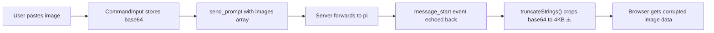

# UI Tweaks: Image Fix, Collapse Icon, Sidebar Default, Folder Pin Icons

## Problem Statement

Five UI issues to address:

1. **Pasted images break after display** — When a user pastes an image and sends a message, the image appears correctly in the optimistic pending prompt preview. However, once the server echoes the message back, the image renders as a broken placeholder showing "🖼 Attachment 1" with the browser's broken-image icon. The base64 data is corrupted by server-side string truncation.
2. **Sidebar collapse icon is in the header** — The collapse chevron sits in the `SessionList` header toolbar, hard to find. Should be on the sidebar edge.
3. **Sidebar default width too narrow** — Default is 256px but max is 500px. Should default to 500px (the max) so users see full content without resizing.
4. **Folder card pin icons are redundant** — Pinned folders show a yellow 📌 icon on the left AND an unpin button on the right. The right-side pin icon alone is sufficient: yellow = pinned (click to unpin), muted = unpinned (click to pin). The left icon should instead be a folder open/closed indicator matching the collapse state.
5. **Mermaid diagrams use wrong font** — Mermaid renders with its built-in default font instead of the dashboard's system font stack (`-apple-system, BlinkMacSystemFont, 'Segoe UI', Roboto, sans-serif`). Sequence diagrams, flowcharts, and other diagram types all show mismatched fonts.
6. **Selected session card barely visible** — The selected session card only has a `border-l-2 border-l-blue-500/40` (2px left border at 40% opacity). This is too subtle to quickly identify which session is active. Needs a stronger visual indicator.


## Root Cause Analysis

### Issue 1: Broken pasted images



**`src/server/memory-event-store.ts` line 37**: `DEFAULT_MAX_STRING_SIZE = 4_000`. The `truncateStrings()` function truncates ALL strings over 4KB, including base64 image data (typically 50KB–500KB), appending "…[truncated]" which makes the base64 invalid.

### Issue 2: Collapse icon location

Currently in `SessionList` header alongside theme toggle, filters, settings — buried among many buttons:
```
[π] [ThemePicker] [ThemeToggle] [Active only] [Show hidden] [📌+] [←] [Install] [Tunnel] [⚙]
```

### Issue 3: Sidebar default width

`src/client/hooks/useSidebarState.ts`: `DEFAULT_WIDTH = 256`, `MAX_WIDTH = 500`. First-time users get a narrow sidebar.

### Issue 4: Redundant pin icons

Current folder card header for pinned directory:
```
[▶] 📌 ~/Project/foo  (3)  [📌off]
```
Both the left yellow pin icon and the right unpin button convey "this is pinned". Redundant.

For unpinned:
```
[▶] 📁 ~/Project/bar  (2)  [📌]
```

## Proposed Changes

### 1. Fix broken pasted images (bug fix)

**File**: `src/server/memory-event-store.ts`

In `truncateStrings()`, skip truncation for string fields named `"data"` when the parent object also has a `"mimeType"` key. This preserves base64 image content while still truncating other large strings.

```typescript
// In the object branch of truncateStrings:
if (key === "data" && typeof val === "string" && "mimeType" in obj) {
  result[key] = val; // preserve image base64 data
  continue;
}
```

**Scope**: ~5 lines added.

### 2. Move collapse icon to sidebar edge

**Files**: `src/client/components/ResizableSidebar.tsx`, `src/client/components/SessionList.tsx`

- **Remove** the `←` collapse button from `SessionList` header (remove the `onCollapseSidebar` button block)
- **Add** a floating pill-shaped collapse button (`w-5 h-8 rounded-full`) that sits on the sidebar edge, vertically centered, half-overlapping the border (`translate-x-1/2`). Has its own background, border, and shadow so it's clearly visible against any theme. Drag handle remains a separate `w-1` strip.
- **Remove** double-click-to-collapse on drag handle — redundant with explicit button and caused accidental collapse/expand when clicking nearby elements (e.g. π logo)
- When **collapsed**, the expand button uses the same floating pill style on the collapsed strip edge

**Scope**: ~20 lines in `ResizableSidebar.tsx`, ~5 lines removed from `SessionList.tsx`.

### 3. Sidebar default to max width

**File**: `src/client/hooks/useSidebarState.ts`

Change `DEFAULT_WIDTH` from `256` to `500` (same as `MAX_WIDTH`).

**Scope**: 1 line.

### 4. Unify folder pin icons

**File**: `src/client/components/SessionList.tsx` — `renderGroup()` function

**Before** (pinned):
```
[▶] 📌yellow dirName (count)  [📌off]
```

**After** (pinned):
```
[▶] 📂 dirName (count)  [📌 yellow, click to unpin]
```

**Before** (unpinned):
```
[▶] 📁 dirName (count)  [📌 muted, click to pin]
```

**After** (unpinned):
```
[▶] 📁 dirName (count)  [📌 muted, click to pin]
```

Changes:
- Left icon: always a folder icon — `mdiFolderOpen` when expanded, `mdiFolder` when collapsed. No pin icon on the left.
- Right icon: single `mdiPin` icon — yellow when pinned (click to unpin), muted when unpinned (click to pin). Remove the separate `mdiPinOff` variant.

**Scope**: ~15 lines changed in `renderGroup()`.

### 5. Stronger selected session card indicator

**File**: `src/client/components/SessionCard.tsx`

Current selected style: `border-l-2 border-l-blue-500/40` — a 2px left border at 40% opacity, barely noticeable.

Replace with a more prominent indicator: full border highlight with a subtle background tint:
- `border-blue-500/60` (full border, not just left)
- `bg-blue-500/5` (subtle blue background tint)
- `ring-1 ring-blue-500/30` (outer glow ring)

**Scope**: ~5 lines in `SessionCard.tsx`.

## Implementation Order

1. **Fix #1** — Broken images (bug fix, ~5 lines)
2. **Fix #3** — Sidebar default width (1 line)
3. **Fix #4** — Folder pin icons (15 lines)
4. **Fix #5** — Selected session indicator (~5 lines)
5. **Fix #2** — Collapse icon placement (~25 lines)

## Risks

- **Image truncation fix**: The `mimeType` sibling check ensures only actual image data is preserved, not arbitrary large `data` fields.
- **Sidebar default width**: Only affects first-time users (or those who clear localStorage). Existing users keep their saved width.
- **Collapse icon on drag handle**: Must not interfere with drag-to-resize. The button should capture click events while the surrounding area handles drag.

## Test Plan

- **Image fix**: Unit test for `truncateStrings` verifying image data preservation.
- **Sidebar width**: Unit test that `DEFAULT_WIDTH === MAX_WIDTH`.
- **Pin icons**: Visual verification — yellow pin = pinned, muted pin = unpinned, folder icon reflects collapse state.
- **Collapse icon**: Visual testing — hover reveals chevron on sidebar edge, click collapses, drag still resizes.
