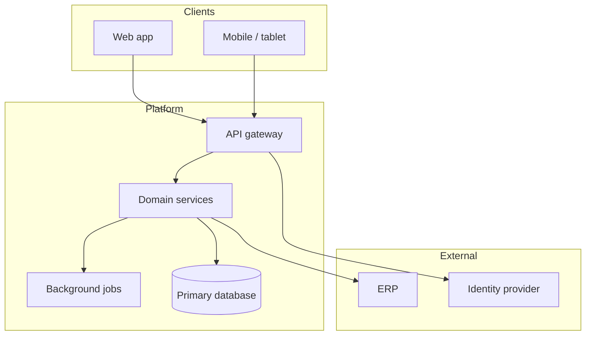
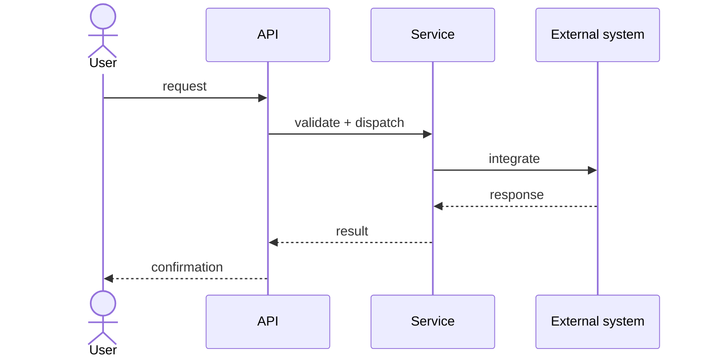

# Architecture Plan — {{PROJECT}}

**Client:** {{CLIENT}}
**Date:** {{DATE}}
**Status:** Draft for estimation

> This plan exists to make the estimate defensible. Every component listed here either
> implements a use case or is forced into existence by an NFR — and the trace matrix
> below says which.

## 1. Context

- **Problem:** {{ONE PARAGRAPH: what is broken today}}
- **Users and actors:** {{who touches the system, human and machine}}
- **Codebase:** greenfield | brownfield | legacy
- **Domain constraints:** {{regulatory, operational, physical}}

## 2. Technology stack

| Layer | Choice | Why | Estimation impact |
|---|---|---|---|
| Backend | | | |
| Frontend | | | |
| Data | | | |
| Integration | | | |
| Infrastructure | | | |
| Identity | | | |
| Observability | | | |

State the estimation impact explicitly: a low-code platform or a heavy framework moves
hours-per-UCP more than any other single decision.

## 3. Component view

## 4. Key flows

Add one sequence diagram per use case that carries real risk. Skip the obvious ones.

## 5. Architecture decisions

### ADR-01: {{Decision title}}
- **Context:** {{the forces}}
- **Decision:** {{what was chosen}}
- **Alternatives rejected:** {{and why}}
- **Consequences:** {{including the effort consequence}}
- **Estimation impact:** {{which use cases or factors this changes}}

Repeat per material decision. A decision with no estimation impact probably does not
need an ADR at this stage.

## 6. NFR → component trace matrix

**This is the most important table in the document.** It is what turns "we need high
availability" into a defensible line of effort.

| NFR | Target | Components forced into existence | Path | Sized as |
|---|---|---|---|---|
| NFR-01 | | | derived-scope | {{transactions or hours}} |
| NFR-02 | | | multiplier | ×{{value}} |

Each NFR takes exactly one path. See `references/nfr-catalog.md`.

## 7. Risks carried into the estimate

| # | Risk | Likelihood | Impact | Where it shows up in the estimate |
|---|---|---|---|---|
| R1 | | | | e.g. UC-08 marked `risk: high` |
| R2 | | | | e.g. COCOMO `PREC: low` |

Every risk should map to something concrete in the estimate input — a risk level, a
scale factor, a contingency, or a named assumption. A risk that changes no number is
decoration.

## 8. Explicitly out of scope

- {{the things that will otherwise be assumed included}}
